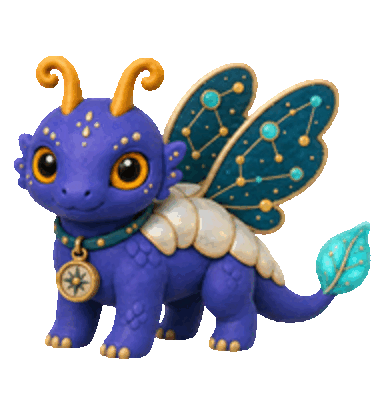

# Gukbap's Codex Pets

A growing collection of original local pets for Codex.

BusanGukbap이 만든 Codex 로컬 펫 모음입니다. 각 펫은 독립적으로 설치할 수 있는 완성된 패키지입니다.

## Pets

<table>
  <tr>
    <th>Vesper</th>
    <th>Valens</th>
  </tr>
  <tr>
    <td><a href="pets/vesper/"></a></td>
    <td><a href="pets/valens/"></a></td>
  </tr>
  <tr>
    <td>A curious violet moon-drake with moth-like wings and a glowing leaf-tail.<br>나방 같은 날개와 빛나는 잎사귀 꼬리를 지닌 보랏빛 달의 드레이크.</td>
    <td>A steadfast young knight in polished plate armor and a midnight-blue cloak.<br>잘 닦인 판금 갑옷과 짙은 남색 망토를 두른 굳건한 젊은 기사.</td>
  </tr>
</table>

Open a pet's folder to see its animation gallery, details, and installation steps.

각 펫 폴더의 README에서 애니메이션, 소개, 설치 방법을 확인할 수 있습니다.

## Repository layout

Every pet lives in its own self-contained folder under `pets/`.

```text
pets/
├── vesper/
│   ├── README.md
│   ├── pet.json
│   └── spritesheet.webp
└── valens/
    ├── README.md
    ├── pet.json
    └── spritesheet.webp
```

To install a pet, follow the instructions in that pet's README. Pet packages do not depend on each other.

펫 설치는 원하는 펫의 README 안내를 따르면 됩니다. 각 펫 패키지는 서로 독립적입니다.
