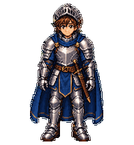
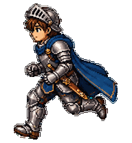
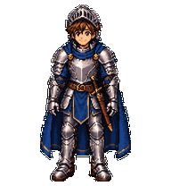
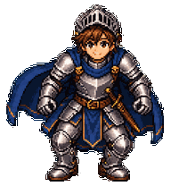
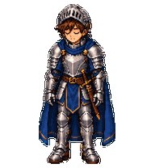
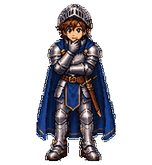
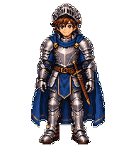
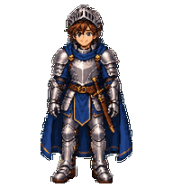
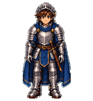

# Valens

[← All Gukbap's Codex Pets](../../README.md)

## Animated preview


Valens's greeting animation, assembled from the pet's own waving frames.

Valens의 인사 동작을 펫의 실제 waving 프레임으로 만든 반복 애니메이션입니다.

Valens is an original Codex pet imagined as a friendly young medieval adventurer. High-density hand-drawn pixel art keeps his short brown hair readable beneath an open, raised visor while clearly separating polished silver full plate, restrained brass fasteners, a midnight-blue cloak and cloth underlayers, and a brown leather belt. His short sword remains permanently sheathed at his hip, leaving both hands free; he carries no shield.

Valens는 친근한 젊은 중세 모험가로 구상한 오리지널 Codex 펫입니다. 밀도 높은 수작업 픽셀 아트로 열어 올린 바이저 아래의 짧은 갈색 머리를 또렷하게 보여 주고, 잘 닦인 은빛 전신 판금 갑옷, 절제된 황동 체결 장식, 짙은 남색 망토와 안쪽 옷감, 갈색 가죽 벨트의 재질을 구분했습니다. 짧은 검은 허리춤의 칼집에 항상 꽂혀 있어 양손이 자유롭고, 방패는 들지 않습니다.

## Animation gallery

Each preview is rendered from Valens's final V2 spritesheet, so it shows the same action or look direction used by the pet in Codex.

각 미리보기는 Valens의 최종 V2 스프라이트시트에서 직접 만들었으며, Codex 펫이 실제로 사용하는 동작과 시선 방향을 보여 줍니다.

<table>
  <tr>
    <th>Idle / 대기</th>
    <th>Drag right / 오른쪽 이동</th>
    <th>Drag left / 왼쪽 이동</th>
  </tr>
  <tr>
    <td></td>
    <td></td>
    <td></td>
  </tr>
  <tr>
    <th>Wave / 인사</th>
    <th>Jump / 점프</th>
    <th>Failed / 실패</th>
  </tr>
  <tr>
    <td></td>
    <td></td>
    <td></td>
  </tr>
  <tr>
    <th>Waiting / 응답 대기</th>
    <th>Working / 작업 중</th>
    <th>Review / 검토</th>
  </tr>
  <tr>
    <td></td>
    <td></td>
    <td></td>
  </tr>
</table>

### Look directions / 시선 방향



In addition to the nine standard actions, the V2 spritesheet contains 16 clockwise look directions spaced 22.5 degrees apart.

9개의 표준 동작과 함께, V2 스프라이트시트에는 22.5도 간격으로 배치된 시계 방향 16개 시선 방향이 들어 있습니다.

## About Valens

### Why "Valens"?

*Valens* is a Latin adjective that can carry senses such as “strong,” “vigorous,” “healthy,” or “capable,” depending on context. The name was chosen to evoke Valens's steady resolve and youthful vitality rather than to claim one exclusive English translation.

*Valens*는 문맥에 따라 ‘강한’, ‘활기찬’, ‘건강한’, ‘유능한’ 등의 뜻을 지닐 수 있는 라틴어 형용사입니다. 하나의 고정된 번역만이 옳다고 단정하기보다, Valens의 굳건함과 젊은 활력을 떠올리게 하는 이름으로 골랐습니다.

The pet is identified internally as `valens` and appears in Codex as **Valens**. Its manifest description is “A steadfast young knight in polished plate armor and a midnight-blue cloak.” Its visual definition is packaged as a single spritesheet, so the pet can be installed by copying the package files into the local Codex pets directory.

펫의 내부 ID는 `valens`이며 Codex에는 **Valens**로 표시됩니다. 매니페스트 설명은 “A steadfast young knight in polished plate armor and a midnight-blue cloak.”입니다. 시각 정보는 하나의 spritesheet에 담겨 있어, 패키지 파일을 로컬 Codex 펫 폴더에 복사하면 설치할 수 있습니다.

The included manifest currently uses sprite version `2`. Keep `pet.json` and `spritesheet.webp` together with their original filenames: the manifest resolves the asset through `spritesheetPath`, so renaming or separating the files prevents Codex from finding the artwork.

현재 매니페스트는 sprite version `2`를 사용합니다. `pet.json`과 `spritesheet.webp`는 원래 이름 그대로 같은 폴더에 두세요. 매니페스트가 `spritesheetPath`로 자산을 찾기 때문에 파일 이름을 바꾸거나 분리하면 Codex가 이미지를 찾지 못합니다.

## Files

- `valens-preview.gif` - Animated README preview showing Valens's greeting loop. This file is for documentation only and is not required for installation.
- `valens-preview.gif` - Valens의 인사 동작을 보여 주는 README용 애니메이션입니다. 문서용 파일이라 설치에는 필요하지 않습니다.
- `previews/*.gif` - Animation gallery for all nine Valens action states and the 16-direction V2 look cycle. These files are for documentation only and are not required for installation.
- `previews/*.gif` - Valens의 9개 동작 상태와 V2의 16개 시선 방향을 보여 주는 README용 애니메이션입니다. 설치에는 필요하지 않습니다.
- `valens-preview.png` - Static README preview image for Valens.
- `valens-preview.png` - Valens의 정적 README 미리보기 이미지입니다.
- `pet.json` - Codex pet manifest. Defines the pet ID, visible name, description, sprite version, and the relative path to the spritesheet.
- `pet.json` - 펫 ID, 표시 이름, 설명, 스프라이트 버전, spritesheet의 상대 경로를 정의하는 Codex 펫 매니페스트입니다.
- `spritesheet.webp` - Valens's complete visual asset. Codex reads this file according to the sprite version declared in the manifest.
- `spritesheet.webp` - Valens의 전체 시각 자산입니다. Codex는 매니페스트에 선언된 스프라이트 버전에 따라 이 파일을 읽습니다.

## Install

Run these commands from the `pets/valens` folder, then copy the package files into your Codex pets directory:

`pets/valens` 폴더에서 아래 명령을 실행해, 패키지 파일을 Codex 펫 디렉터리에 복사합니다.

```powershell
$target = "$env:USERPROFILE\.codex\pets\valens"
New-Item -ItemType Directory -Force -Path $target
Copy-Item .\pet.json "$target\pet.json" -Force
Copy-Item .\spritesheet.webp "$target\spritesheet.webp" -Force
```

Restart Codex if the pet does not appear immediately. If it still does not appear, confirm that the final folder is `%USERPROFILE%\.codex\pets\valens` and that both files are present directly inside it, rather than in an additional nested folder.

펫이 바로 표시되지 않으면 Codex를 다시 시작하세요. 그래도 보이지 않으면 최종 폴더가 `%USERPROFILE%\.codex\pets\valens`인지, 두 파일이 한 단계 더 깊은 하위 폴더가 아니라 그 폴더 바로 아래에 있는지 확인하세요.

## Compatibility

This package contains only Valens's local pet definition and artwork. It does not modify Codex settings, hooks, skills, or any other user configuration. Use a Codex version that supports local pets and retain the original `spriteVersionNumber` unless you also replace the artwork with an asset built for another sprite format.

이 패키지에는 Valens의 로컬 펫 정의와 이미지 파일만 들어 있습니다. Codex 설정, 훅, 스킬, 기타 사용자 설정은 바꾸지 않습니다. 다른 스프라이트 형식으로 만든 이미지를 함께 교체하지 않는 한 원래 `spriteVersionNumber` 값도 유지하세요.